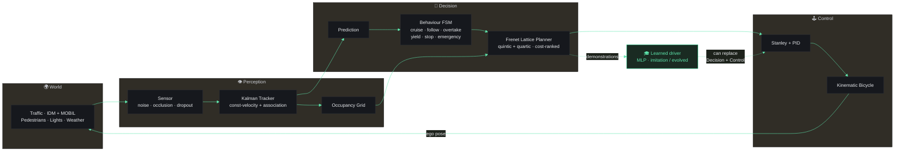

<p align="center">
  <a href="https://realblueline.vercel.app" title="Open the live Blueline simulator">
    
  </a>
</p>

<h1 align="center">▍&nbsp;B&nbsp;L&nbsp;U&nbsp;E&nbsp;L&nbsp;I&nbsp;N&nbsp;E</h1>

<p align="center">
  <a href="https://realblueline.vercel.app"></a>
</p>

<p align="center">
  <b>A self-driving car that runs a <em>real autonomy stack</em> in your browser —<br/>
  and a neural driver you <em>train, evolve, and race</em> against it. Live. No backend.</b>
</p>

<p align="center">
  <b>Perception → Planning → Control</b> · a classical stack
  &nbsp;&nbsp;•&nbsp;&nbsp;
  <b>Trained live</b> · imitation + neuroevolution
  &nbsp;&nbsp;•&nbsp;&nbsp;
  <b>0 collisions</b> · 9 scenarios
</p>

<p align="center">
  <a href="https://www.typescriptlang.org/"></a>
  <a href="https://threejs.org/"></a>
  <a href="https://vitejs.dev/"></a>
  <a href="#-the-learned-drivers--no-ml-library"></a>
  <a href="#-proof-it-actually-works"></a>
  <a href="#run-it"></a>
</p>

<p align="center">
  <a href="#two-schools-of-autonomy-side-by-side"><b>How it works</b></a> &nbsp;·&nbsp;
  <a href="#-watch-it-drive"><b>Watch it drive</b></a> &nbsp;·&nbsp;
  <a href="#-the-learned-drivers--no-ml-library"><b>The neural drivers</b></a> &nbsp;·&nbsp;
  <a href="#-proof-it-actually-works"><b>Proof</b></a> &nbsp;·&nbsp;
  <a href="#run-it"><b>Run it</b></a>
</p>

<br/>

<h2 align="center">Two schools of autonomy, <em>side by side</em></h2>

<p align="center">
  Blueline is a working implementation of the <b>modular autonomy pipeline</b> from real self-driving<br/>
  research — visualised like a Tesla — plus a second, <em>learned</em> stack you train yourself.<br/>
  Two entire approaches, directly comparable, at 60&nbsp;FPS in a browser tab.<br/>
  <sub><b>~6,400 lines of TypeScript. No game engine. No ML library. No server.</b></sub>
</p>

<table>
<tr>
<td width="33%" valign="top" align="center">

### 🧭 Classical stack
Every named algorithm, wired end to end — **Frenet** lattice planning, **IDM/MOBIL** traffic, **Kalman** tracking, **Stanley** control. Verified headless in Node.

</td>
<td width="33%" valign="top" align="center">

### 🧠 Learned stack
A pure-TS **MLP** (backprop + Adam) trained by **behavioural cloning + DAgger**, and a policy found by **neuroevolution** — no teacher, no framework.

</td>
<td width="33%" valign="top" align="center">

### 📊 Scorecard + race
Live **safety / comfort / efficiency** scoring, and a head-to-head **benchmark** of all three drivers on one identical seeded course.

</td>
</tr>
</table>

<br/><br/>

<h2 align="center">🎬 Watch it <em>drive</em></h2>

<table>
<tr>
<td width="50%" align="center">
<br/>
<sub><b>Chase cam</b> — cruising the block, lane markings, live telemetry.</sub>
</td>
<td width="50%" align="center">
<br/>
<sub><b>Neural net at the wheel</b> — trained live (watch the loss fall), then driving.</sub>
</td>
</tr>
<tr>
<td width="50%" align="center">
<br/>
<sub><b>Top-down</b> — a rounded 90° junction, cross-streets, radar, occupancy grid.</sub>
</td>
<td width="50%" align="center">
<br/>
<sub><b>Rain</b> — weather physically <i>degrades sensor range</i> (95 m → 68 m).</sub>
</td>
</tr>
</table>

<br/><br/>

<h2 align="center">The <em>modular</em> autonomy pipeline</h2>

<p align="center">
  Every arrow is a real module. The ego <b>never reads ground truth</b> — it plans off noisy<br/>
  sensor detections fused by a Kalman tracker, exactly like the real thing.
</p>



<details>
<summary><b>The stack, module by module</b> — with source links</summary>

<br/>

| Layer | Technique | Source |
|---|---|---|
| **World model** | Arc-length **Frenet frame** (station `s`, lateral `d`) + curvature over a closed centreline | [`world/ReferencePath.ts`](src/world/ReferencePath.ts) |
| **Perception — sensing** | Range + line-of-sight **sensor** with Gaussian noise, occlusion & random dropout | [`perception/Sensor.ts`](src/perception/Sensor.ts) |
| **Perception — tracking** | **Kalman-filter** multi-object tracker (const-velocity), NN data association, track lifecycle, object classes | [`perception/Tracker.ts`](src/perception/Tracker.ts) |
| **Occupancy** | Ego-centred **occupancy grid** | [`perception/OccupancyGrid.ts`](src/perception/OccupancyGrid.ts) |
| **Prediction** | Constant-velocity roll of each track's *estimated* velocity (lateral term for pedestrians) | [`planner/FrenetPlanner.ts`](src/planner/FrenetPlanner.ts) |
| **Behaviour** | **Finite-state machine**: cruise / follow / overtake / emergency / yield / stop | [`behavior/BehaviorPlanner.ts`](src/behavior/BehaviorPlanner.ts) |
| **Planning** | **Frenet lattice**: quintic + quartic polynomial trajectories, cost-based selection, collision checking | [`planner/FrenetPlanner.ts`](src/planner/FrenetPlanner.ts) · [`core/poly.ts`](src/core/poly.ts) |
| **Control** | **Stanley** lateral tracker + **PID** longitudinal | [`control/`](src/control) |
| **Vehicle** | **Kinematic bicycle model** | [`vehicle/Vehicle.ts`](src/vehicle/Vehicle.ts) |
| **Traffic** | **IDM** car-following + **MOBIL** lane changes | [`traffic/`](src/traffic) |
| **Urban** | **Traffic lights** with stop-line planning | [`world/TrafficLight.ts`](src/world/TrafficLight.ts) |

The entire simulation core imports **zero Three.js** and runs headless in Node — which is
exactly why every claim below is a passing test, not a screenshot.

</details>

<br/><br/>

<h2 align="center">📐 The mathematics behind the blue line</h2>

<p align="center">
  Every box in that diagram is a real equation the car solves ~60 times a second.<br/>
  Here is the whole stack, straight from the source — nothing hand-waved.
</p>

### 🛣 Geometry — the Frenet frame

The world is re-expressed along the road: station $s$ (distance along) and lateral offset $d$ (distance off centre). A world point, and the road's curvature, are

$$\mathbf{p}(s,d) = \mathbf{c}(s) + d\mathbf{n}(s) \qquad \mathbf{n}(s) = \big(-\sin\theta(s),\ \cos\theta(s)\big)$$

$$\kappa(s) = \left|\frac{d\theta}{ds}\right| \approx \frac{\big|\theta(s+\Delta s) - \theta(s-\Delta s)\big|}{2\Delta s}$$

so the car knows precisely how hard to slow for a bend, capping speed at the lateral-acceleration limit $a^{\text{lat}}_{\max}=2.2$ m/s²:

$$v_{\max}(s) = \sqrt{\frac{a^{\text{lat}}_{\max}}{\kappa(s)}}$$

<sub>→ <code>world/ReferencePath.ts</code> · <code>sim/Simulation.ts</code></sub>

### 🧭 Planning — the Werling Frenet lattice

Each frame samples a lattice of manoeuvres. Lateral motion is a **quintic** (six boundary conditions — position, velocity *and* acceleration pinned at both ends); longitudinal is a **quartic** (terminal position left free):

$$d(t) = \sum_{i=0}^{5} a_i t^i \qquad\qquad s(t) = \sum_{i=0}^{4} b_i t^i$$

Every candidate is scored, and the car draws the **arg-min**:

$$J = \underbrace{k_j\int_0^T\big(\dddot{d}^2 + \dddot{s}^2\big)dt + k_t T}_{\text{comfort}} + \underbrace{k_v(v_d - v_T)^2}_{\text{speed}} + \underbrace{k_{lc}|\ell - \ell_0| + k_b|\ell - \ell^{\star}|}_{\text{lane}} + \underbrace{k_p\sum_{\text{obstacles}}\frac{1}{\text{gap}}}_{\text{proximity}}$$

<sub>colliding candidates take a +10⁶ penalty, dynamically-infeasible ones +10⁵ → <code>planner/FrenetPlanner.ts</code> · <code>core/poly.ts</code></sub>

### 🚗 Traffic — IDM + MOBIL

Ambient cars follow the **Intelligent Driver Model** — a desired gap, and an acceleration that closes it:

$$s^{\star}(v,\Delta v) = s_0 + \max\left(0,\ vT + \frac{v\Delta v}{2\sqrt{ab}}\right) \qquad a_{\text{IDM}} = a\left[1 - \left(\frac{v}{v_0}\right)^{\delta} - \left(\frac{s^{\star}}{s}\right)^{2}\right]$$

and change lanes by **MOBIL** only when the net incentive beats a threshold — never braking the new follower past $b_{\text{safe}}$:

$$\Delta a_{\text{self}} + p\big(\Delta a_{\text{new}} + \Delta a_{\text{old}}\big) + a_{\text{bias}} > \Delta a_{\text{th}}$$

<sub>→ <code>traffic/IDM.ts</code> · <code>traffic/MOBIL.ts</code></sub>

### 🕹 Control — Stanley + PID + bicycle

Steering drives **both** the heading error $\psi_e$ and the cross-track error $e$ to zero:

$$\delta = \psi_e + \arctan\left(\frac{ke}{v + k_{\text{soft}}}\right)$$

Speed is a PID on the target-speed error; the vehicle itself is a **kinematic bicycle** — nonholonomic, "can't slide sideways":

$$u = k_p e + k_i\int e\ dt + k_d\dot e \qquad\qquad \dot x = v\cos\psi \quad \dot y = v\sin\psi \quad \dot\psi = \frac{v}{L}\tan\delta \quad \dot v = a$$

<sub>→ <code>control/Stanley.ts</code> · <code>control/PID.ts</code> · <code>vehicle/Vehicle.ts</code></sub>

### 👁 Perception — the Kalman filter

Each tracked object is a constant-velocity state $\mathbf{x} = [p_x, p_y, v_x, v_y]^{\top}$, smoothed by a Kalman filter that **predicts**, then **corrects** against the noisy detection $\mathbf{z}$:

$$\hat{\mathbf{x}}^{-} = F\hat{\mathbf{x}} \qquad P^{-} = F P F^{\top} + Q$$

$$\mathbf{y} = \mathbf{z} - H\hat{\mathbf{x}}^{-} \qquad S = H P^{-} H^{\top} + R \qquad K = P^{-} H^{\top} S^{-1}$$

$$\hat{\mathbf{x}} = \hat{\mathbf{x}}^{-} + K\mathbf{y} \qquad P = (I - K H)P^{-}$$

<sub>the ego plans off the estimate, never ground truth → <code>perception/Tracker.ts</code></sub>

### 🧠 Learning — MLP, backprop, Adam

The neural driver is a tanh MLP with a linear head, trained to minimise MSE against the expert's action:

$$a^{(l)} = \tanh\big(W^{(l)}a^{(l-1)} + b^{(l)}\big) \qquad \mathcal{L} = \frac{1}{2N}\sum_{n} \big\lVert a^{(L)}_n - y_n \big\rVert^2$$

Gradients flow back through the tanh, and **Adam** takes the step:

$$\delta^{(L)} = a^{(L)} - y \qquad \delta^{(l)} = \big(W^{(l+1)\top}\delta^{(l+1)}\big)\odot\big(1 - a^{(l)}\odot a^{(l)}\big)$$

$$m \leftarrow \beta_1 m + (1-\beta_1)g \quad v \leftarrow \beta_2 v + (1-\beta_2)g^2 \quad \theta \leftarrow \theta - \frac{\eta\hat{m}}{\sqrt{\hat{v}} + \epsilon}$$

<sub>β₁=0.9, β₂=0.999, ε=10⁻⁸, Xavier init, tanh′ = 1−a² → <code>learn/NN.ts</code></sub>

### 🧬 Evolution — survival of the fittest driver

With **no teacher**, genomes are scored by the *worst of two* rollouts (so the winner must generalise, not memorise), then bred by tournament selection + uniform crossover + annealed Gaussian mutation:

$$\mathcal{F}(\theta) = \min_{r\in\{1,2\}} \sum_{t}\Big(\underbrace{v_t\Delta t}_{\text{progress}} - 0.6\max(0,\ |d_t|-2)\Delta t\Big) - \text{penalty}_{\text{crash / off-road}}$$

$$\sigma_g = 0.25\left(1 - \frac{g}{G}\right) + 0.03 \qquad \text{(mutation scale, annealed over generations)}$$

<sub>→ <code>learn/Evolution.ts</code></sub>

### 📊 The scorecard

And all three drivers are ranked on one honest scale:

$$\text{safety} = 100 - 30 n_{\text{col}} - 120 f_{\text{off-road}} - 5\max(0,\ 6 - g_{\min})$$

$$\text{comfort} = 100 - 14\overline{|a|} - 5\overline{|j|} \qquad\quad \text{efficiency} = 100\cdot\frac{\bar{v}}{v_d}$$

$$\text{overall} = 0.5\cdot\text{safety} + 0.25\cdot\text{comfort} + 0.25\cdot\text{efficiency}$$

<sub>→ <code>sim/Metrics.ts</code></sub>

<p align="center"><sub><b>Geometry to gradients — that's the whole car, ~6,400 lines of it.</b></sub></p>

<br/><br/>

<h2 align="center">🧠 The <em>learned</em> drivers — no ML library</h2>

<p align="center">
  A pure-TypeScript MLP with backprop + Adam (<a href="src/learn/NN.ts"><code>learn/NN.ts</code></a>) learns to drive from a<br/>
  16-feature view of the road. Two ways to teach it — <b>watch the loss curve fall in real time.</b>
</p>

<p align="center">
  
</p>

<table>
<tr>
<td width="50%" valign="top">

### 🎓 Imitation + DAgger
The classical stack drives; the network records `(state → action)` demonstrations and clones them. Then **DAgger** flips it — the *learner* drives while the *expert* labels the states it actually visits, curing the covariate-shift drift that sinks naive cloning.

> **Result:** holds its lane at **max 0.99 m** off centre (half-width 5.55 m) over **1.05 km**, **0 collisions.**

→ [`ImitationAgent.ts`](src/learn/ImitationAgent.ts) · [`Trainer.ts`](src/learn/Trainer.ts)

</td>
<td width="50%" valign="top">

### 🧬 Neuroevolution — no teacher
A genetic algorithm evolves the weights, scored purely by driving-rollout fitness (distance minus penalties for leaving the road or hitting traffic). Selection + crossover + mutation discover a driver **from random weights.**

> **Result:** fitness climbs **53 → 378** over 16 generations; the champion then drives **1.52 km**, **0 collisions.**

→ [`Evolution.ts`](src/learn/Evolution.ts)

</td>
</tr>
</table>

<p align="center">
  A <b>safety shield</b> (AEB + lane-keeping + virtual guardrail) guards the learned drivers in play —<br/>
  but switches <b>off</b> during evolution, so fitness judges the raw policy, not the shield.
</p>

<br/><br/>

<h2 align="center">📊 <em>Proof</em> it actually works</h2>

<p align="center">
  Everything is verified <b>headless and deterministically</b> in Node (seeded RNG) — no browser,<br/>
  no hand-waving. Reproduce every number yourself (see <a href="#run-it">Run it</a>).
</p>

<p align="center">
  
</p>

<p align="center">
  <sub><b>In-browser head-to-head</b> — all three drivers over one identical seeded course. Classical wins on balance;<br/>the evolved policy is fastest but rougher. All three: <b>zero collisions.</b></sub>
</p>

**`smoke.ts` — the classical stack across 9 scenarios**

```text
[highway]     0.74 km   CRUISE                                  crashes 0   ped-hits 0
[highway@fast]1.09 km   CRUISE                                  crashes 0   ped-hits 0
[stalled]     0.51 km   CRUISE · OVERTAKE                       crashes 0   ped-hits 0
[cutin]       0.47 km   CRUISE · OVERTAKE                       crashes 0   ped-hits 0
[trucks]      0.58 km   CRUISE · OVERTAKE · FOLLOW              crashes 0   ped-hits 0
[crossing]    0.53 km   CRUISE · YIELD · OVERTAKE · STOP        crashes 0   ped-hits 0
[occluded]    0.58 km   CRUISE · OVERTAKE · YIELD · STOP        crashes 0   ped-hits 0
[jaywalker]   0.53 km   CRUISE · YIELD · STOP                   crashes 0   ped-hits 0
[rush]        0.62 km   CRUISE · YIELD · STOP                   crashes 0   ped-hits 0

SMOKE PASS — all scenarios: on-road, zero collisions, pedestrians safe.
```

<table>
<tr>
<td valign="top" width="50%">

**`learn-test.ts` — the net learns**
```text
DAgger 4: samples 60000, loss 0.0230
network now driving:
  [highway] 1.05 km | max|d| 0.99 (half 5.55) | crash 0
  [trucks]  0.61 km | max|d| 1.14 (half 5.55) | crash 0
LEARN-TEST PASS
```

</td>
<td valign="top" width="50%">

**`evo-test.ts` — evolution from scratch**
```text
gen 16/16: best 378.2, avg 151.4
fitness: 53.1 -> 378.2
champion drives: 1.52 km | crash 0
EVO-TEST PASS
```

</td>
</tr>
</table>

<p align="center">
  Plus <code>lights-test.ts</code> (stops on red, goes on green) and <code>weather-test.ts</code> (rain/fog degrade the sensor). <b>All green.</b>
</p>

<br/><br/>

<h2 align="center">🎬 One-click <em>scenarios</em></h2>

<p align="center">
  <code>Highway</code> · <code>Trucks</code> (overtake a convoy) · <code>Stalled</code> car · <code>Cut-in</code> · <code>Dense</code> traffic ·<br/>
  <code>Crossing</code> pedestrian · <b><code>Occluded ped</code></b> (steps out from behind a stalled car, seen late) ·<br/>
  <code>Jaywalker</code> (emergency stop) · <b><code>🚦 Lights</code></b> · <b><code>🌆 Rush hour</code></b>
</p>

<p align="center">
  Deep-link any of them: <code>?scenario=occluded&cam=top&weather=rain</code>
</p>

<br/>

## Run it

```bash
npm install
npm run dev        # → http://localhost:5173
npm run build      # typecheck + production bundle → dist/  (drop on any static host)
```

<details>
<summary><b>Headless verification</b> — reproduce every number above, no browser needed</summary>

<br/>

```bash
npx tsx scripts/smoke.ts        # 9 scenarios: on-road, zero vehicle & pedestrian collisions
npx tsx scripts/learn-test.ts   # the neural net learns to drive (imitation + DAgger)
npx tsx scripts/evo-test.ts     # neuroevolution discovers a driver from random weights
npx tsx scripts/lights-test.ts  # ego obeys the traffic light
npx tsx scripts/weather-test.ts # rain/fog degrade perception
```

Each asserts real, measurable behaviour — stays on road, zero collisions, loss falls,
fitness climbs, red light obeyed.

</details>

<p align="center">
  <b>Keyboard</b> &nbsp;·&nbsp; <code>1–9</code> scenarios &nbsp;·&nbsp; <code>T</code> train &nbsp;·&nbsp; <code>E</code> evolve &nbsp;·&nbsp; <code>C/N/V</code> switch driver &nbsp;·&nbsp; <code>Space</code> pause &nbsp;·&nbsp; <code>R</code> reset &nbsp;·&nbsp; <code>B</code> benchmark
</p>

<br/>

## Under the hood

**TypeScript · Three.js · Vite.** Fixed-timestep deterministic physics & planning, decoupled
from the render loop. The neural networks — MLP with backprop + Adam, and the genetic
algorithm — are written by hand; there is **no TensorFlow, no PyTorch, no ONNX.** No backend,
no build-time secrets. It's a static site.

The render layer (Three.js + UnrealBloom, the green path ribbon, candidate-trajectory viz,
the Tesla-style DOM HUD) is a thin skin over a headless core — which is why the same code that
renders in the browser is the code the tests drive in Node.

## Roadmap

- [x] Classical AV stack — Frenet planner, IDM/MOBIL, Stanley + PID, Kalman tracking
- [x] Pedestrians + hard cases — crossing / occluded / jaywalker
- [x] City map — rounded 90° junctions, cross-streets, traffic lights
- [x] **Imitation learning** driver — behavioural cloning + DAgger
- [x] **Neuroevolution** driver — learn from scratch, no teacher
- [x] Analytics — live scorecard + head-to-head benchmark
- [x] Weather — rain/fog that degrades perception
- [ ] Intersections with cross-traffic & turns
- [ ] Reinforcement learning (policy-gradient) driver
- [ ] Recording & replay

<br/>

<p align="center">
  <sub>Built by <a href="https://github.com/codewithfourtix">@codewithfourtix</a> — perception, planning, and a little bit of evolution.</sub>
</p>
