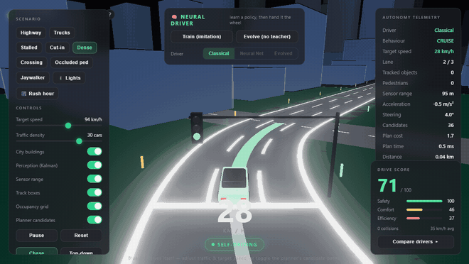
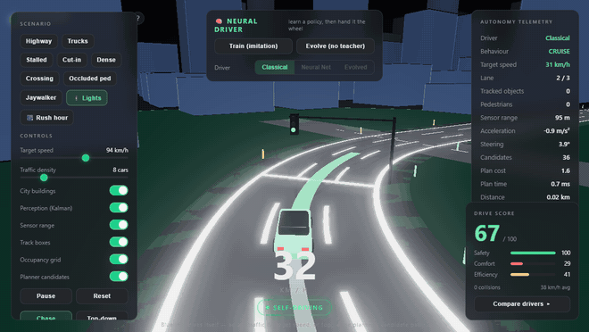
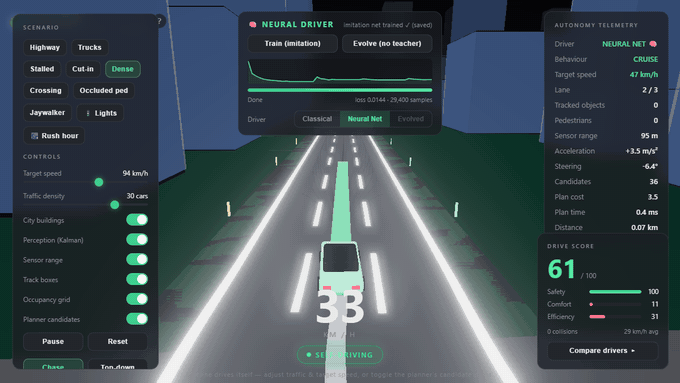
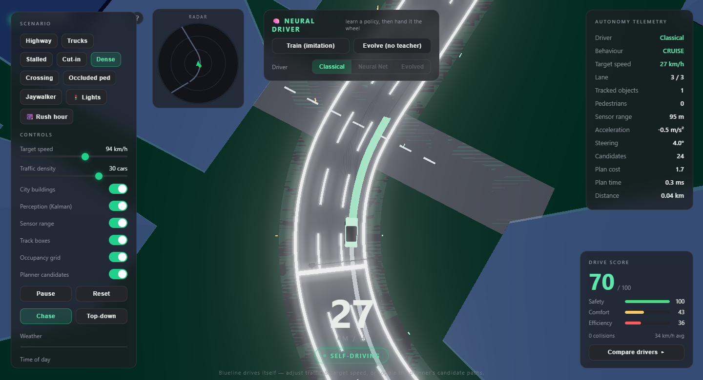
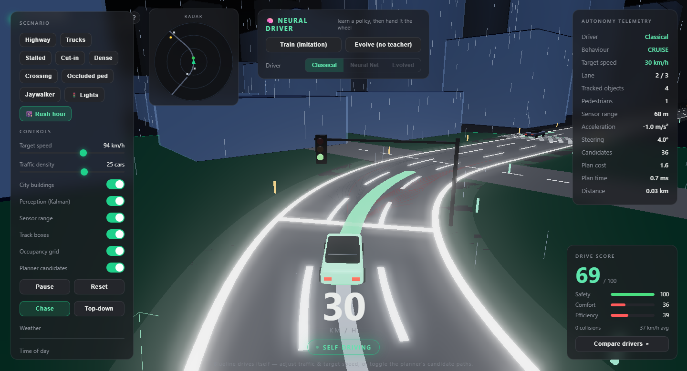
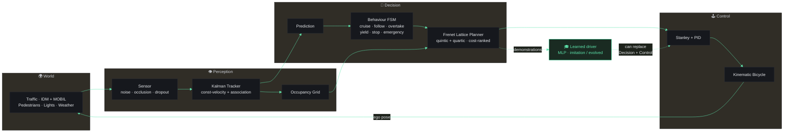
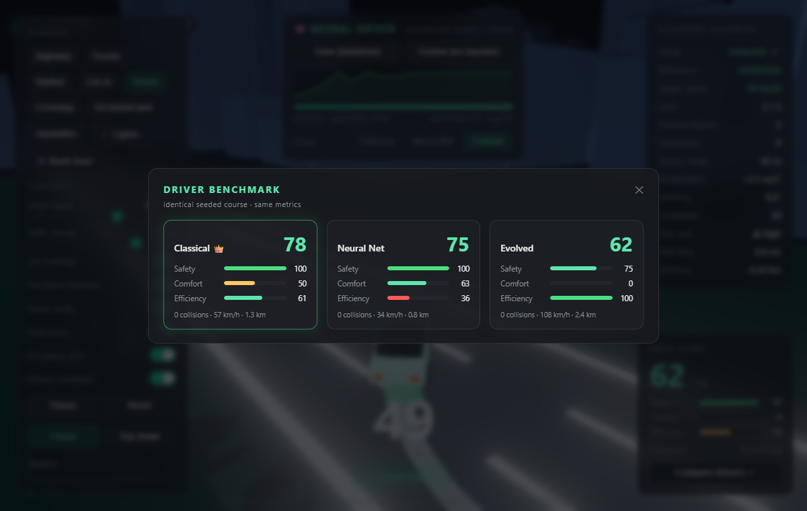

<div align="center">

<h1>
  
  &nbsp;B L U E L I N E
</h1>

### A self-driving car that runs a **real autonomy stack** in your browser — <br/>and a neural driver you **train, evolve, and race** against it. Live. No backend.

<br/>

[](https://www.typescriptlang.org/)
[](https://threejs.org/)
[](https://vitejs.dev/)
[](#-the-learned-drivers--from-scratch-no-ml-library)
[](#-proof-that-it-actually-works)
[](#run-it)

<br/>



<sub><i>Real-time: a Frenet lattice planner picks the green ribbon, Stanley + PID steer it, Kalman tracks the traffic — the ego drives the city block on its own.</i></sub>

<br/><br/>

**[▸ How it works](#the-modular-autonomy-pipeline) · [▸ Watch it drive](#-watch-it-drive) · [▸ The neural drivers](#-the-learned-drivers--from-scratch-no-ml-library) · [▸ Proof](#-proof-that-it-actually-works) · [▸ Run it](#run-it)**

</div>

---

## This is not a car game

Blueline is a working implementation of the **modular autonomy pipeline** used in real
self-driving research — perception → tracking → prediction → behaviour → planning →
control — visualised like a Tesla. Then it adds a second, *learned* stack: a neural
network you can **train by imitation**, **evolve from random weights**, hand the wheel
to, and **benchmark head-to-head** against the hand-engineered planner.

Two entire schools of autonomy, side by side, directly comparable, running at 60 FPS
in a browser tab. **~6,400 lines of TypeScript. No game engine. No ML library. No server.**

<table>
<tr>
<td width="33%" valign="top">

### 🧭 Classical stack
Every named algorithm, wired end to end — **Frenet** lattice planning, **IDM/MOBIL**
traffic, **Kalman** tracking, **Stanley** control. Verified headless.

</td>
<td width="33%" valign="top">

### 🧠 Learned stack
A pure-TS **MLP** (backprop + Adam) trained by **behavioural cloning + DAgger**, and a
policy discovered by **neuroevolution** — no teacher, no framework.

</td>
<td width="33%" valign="top">

### 📊 Scorecard + benchmark
Live **safety / comfort / efficiency** scoring, and a head-to-head race of all three
drivers on one **identical seeded course**.

</td>
</tr>
</table>

---

## 🎬 Watch it drive

<table>
<tr>
<td width="50%" align="center">
<br/>
<sub><b>Chase cam</b> — cruising the block, lane markings, live HUD telemetry.</sub>
</td>
<td width="50%" align="center">
<br/>
<sub><b>Neural net at the wheel</b> — trained live (see the loss curve fall), then driving.</sub>
</td>
</tr>
<tr>
<td width="50%" align="center">
<br/>
<sub><b>Top-down</b> — a rounded 90° junction, cross-streets, radar minimap, occupancy grid.</sub>
</td>
<td width="50%" align="center">
<br/>
<sub><b>Rain</b> — weather physically <i>degrades sensor range</i> (95 m → 68 m) and adds caution.</sub>
</td>
</tr>
</table>

---

## The modular autonomy pipeline

Every arrow below is a real module. The ego **never** reads ground truth — it plans off
noisy sensor detections fused by a Kalman tracker, exactly like the real thing.



<details>
<summary><b>The stack, module by module</b> — with source links</summary>

<br/>

| Layer | Technique | Source |
|---|---|---|
| **World model** | Arc-length **Frenet frame** (station `s`, lateral `d`) + curvature over a closed centreline | [`world/ReferencePath.ts`](src/world/ReferencePath.ts) |
| **Perception — sensing** | Range + line-of-sight **sensor** with Gaussian noise, occlusion & random dropout | [`perception/Sensor.ts`](src/perception/Sensor.ts) |
| **Perception — tracking** | **Kalman-filter** multi-object tracker (const-velocity), NN data association, track lifecycle, object classes | [`perception/Tracker.ts`](src/perception/Tracker.ts) |
| **Occupancy** | Ego-centred **occupancy grid** | [`perception/OccupancyGrid.ts`](src/perception/OccupancyGrid.ts) |
| **Prediction** | Constant-velocity roll of each track's *estimated* velocity (lateral term for pedestrians) | [`planner/FrenetPlanner.ts`](src/planner/FrenetPlanner.ts) |
| **Behaviour** | **Finite-state machine**: cruise / follow / overtake / emergency / yield / stop | [`behavior/BehaviorPlanner.ts`](src/behavior/BehaviorPlanner.ts) |
| **Planning** | **Frenet lattice**: quintic + quartic polynomial trajectories, cost-based selection, collision checking | [`planner/FrenetPlanner.ts`](src/planner/FrenetPlanner.ts) · [`core/poly.ts`](src/core/poly.ts) |
| **Control** | **Stanley** lateral tracker + **PID** longitudinal | [`control/`](src/control) |
| **Vehicle** | **Kinematic bicycle model** | [`vehicle/Vehicle.ts`](src/vehicle/Vehicle.ts) |
| **Traffic** | **IDM** car-following + **MOBIL** lane changes | [`traffic/`](src/traffic) |
| **Urban** | **Traffic lights** with stop-line planning | [`world/TrafficLight.ts`](src/world/TrafficLight.ts) |

The entire simulation core imports **zero Three.js** and runs headless in Node — which is
exactly why every claim below is a passing test, not a screenshot.

</details>

---

## 🧠 The learned drivers — from scratch, no ML library

A pure-TypeScript MLP with backprop + Adam ([`learn/NN.ts`](src/learn/NN.ts)) learns to
drive from a 16-feature view of the road ([`learn/features.ts`](src/learn/features.ts)).
Two ways to teach it — **watch the loss curve fall in real time**:

<table>
<tr>
<td width="50%" valign="top">

### 🎓 Imitation + DAgger
The classical stack drives; the network records `(state → action)` demonstrations and
clones them. Then **DAgger** flips it — the *learner* drives while the *expert* labels the
states it actually visits, curing the covariate-shift drift that sinks naive cloning.

> **Result:** holds its lane at **max 0.99 m** off centre (lane half-width 5.55 m) over
> **1.05 km**, **0 collisions**.

→ [`ImitationAgent.ts`](src/learn/ImitationAgent.ts) · [`Trainer.ts`](src/learn/Trainer.ts)

</td>
<td width="50%" valign="top">

### 🧬 Neuroevolution — no teacher
A genetic algorithm evolves the network weights, scored purely by driving-rollout fitness
(distance minus penalties for leaving the road or hitting traffic). Selection + crossover
+ mutation discover a driver **from random weights**.

> **Result:** fitness climbs **53 → 378** over 16 generations; the champion then drives
> **1.52 km** with **0 collisions**.

→ [`Evolution.ts`](src/learn/Evolution.ts)

</td>
</tr>
</table>

A **safety shield** (AEB + lane-keeping assist + virtual guardrail) guards the learned
drivers in play — but is switched **off** during evolution so fitness judges the raw
policy, not the shield. Toggle **Classical ↔ Neural Net ↔ Evolved** any time and feel a
different brain take the wheel.

---

## 📊 Proof that it actually works

Everything is verified **headless and deterministically** in Node (seeded RNG) — no
browser, no hand-waving. Run any of these yourself (see [Run it](#run-it)).

<div align="center">
<br/>
<sub><b>In-browser head-to-head</b> — all three drivers over one identical seeded course. Classical wins on balance; the evolved policy is fastest but rougher. All three: <b>zero collisions.</b></sub>
</div>

<br/>

**`smoke.ts` — the classical stack across 9 scenarios**

```text
[highway]     0.74 km   CRUISE                                  crashes 0   ped-hits 0
[highway@fast]1.09 km   CRUISE                                  crashes 0   ped-hits 0
[stalled]     0.51 km   CRUISE · OVERTAKE                       crashes 0   ped-hits 0
[cutin]       0.47 km   CRUISE · OVERTAKE                       crashes 0   ped-hits 0
[trucks]      0.58 km   CRUISE · OVERTAKE · FOLLOW              crashes 0   ped-hits 0
[crossing]    0.53 km   CRUISE · YIELD · OVERTAKE · STOP        crashes 0   ped-hits 0
[occluded]    0.58 km   CRUISE · OVERTAKE · YIELD · STOP        crashes 0   ped-hits 0
[jaywalker]   0.53 km   CRUISE · YIELD · STOP                   crashes 0   ped-hits 0
[rush]        0.62 km   CRUISE · YIELD · STOP                   crashes 0   ped-hits 0

SMOKE PASS — all scenarios: on-road, zero collisions, pedestrians safe.
```

<table>
<tr>
<td valign="top" width="50%">

**`learn-test.ts` — the net learns**
```text
DAgger 4: samples 60000, loss 0.0230
network now driving:
  [highway] 1.05 km | max|d| 0.99 (half 5.55) | crash 0
  [trucks]  0.61 km | max|d| 1.14 (half 5.55) | crash 0
LEARN-TEST PASS
```

</td>
<td valign="top" width="50%">

**`evo-test.ts` — evolution from scratch**
```text
gen 16/16: best 378.2, avg 151.4
fitness: 53.1 -> 378.2
champion drives: 1.52 km | crash 0
EVO-TEST PASS
```

</td>
</tr>
</table>

Plus `lights-test.ts` (stops on red, goes on green) and `weather-test.ts` (rain/fog
degrade the sensor). **All green.**

---

## 🎬 Scenarios — one click each

`Highway` · `Trucks` (overtake a convoy) · `Stalled` car · `Cut-in` · `Dense` traffic ·
`Crossing` pedestrian · **`Occluded ped`** (steps out from behind a stalled car, seen
late) · `Jaywalker` (emergency stop) · **`🚦 Lights`** · **`🌆 Rush hour`**.

Deep-link any of them: `?scenario=occluded&cam=top&weather=rain`.

---

## Run it

```bash
npm install
npm run dev        # → http://localhost:5173
npm run build      # typecheck + production bundle → dist/  (drop on any static host)
```

<details>
<summary><b>Headless verification</b> — reproduce every number above, no browser needed</summary>

<br/>

```bash
npx tsx scripts/smoke.ts        # 9 scenarios: on-road, zero vehicle & pedestrian collisions
npx tsx scripts/learn-test.ts   # the neural net learns to drive (imitation + DAgger)
npx tsx scripts/evo-test.ts     # neuroevolution discovers a driver from random weights
npx tsx scripts/lights-test.ts  # ego obeys the traffic light
npx tsx scripts/weather-test.ts # rain/fog degrade perception
```

Each asserts real, measurable behaviour — stays on road, zero collisions, loss falls,
fitness climbs, red light obeyed.

</details>

**Keyboard:** `1–9` scenarios · `T` train · `E` evolve · `C/N/V` switch driver ·
`Space` pause · `R` reset · `B` benchmark.

---

## Under the hood

**TypeScript · Three.js · Vite.** Fixed-timestep deterministic physics & planning,
decoupled from the render loop. The neural networks — MLP with backprop + Adam, and the
genetic algorithm — are written by hand; there is **no TensorFlow, no PyTorch, no ONNX**.
No backend, no build-time secrets. It's a static site.

The render layer (Three.js + UnrealBloom, the green path ribbon, candidate-trajectory
viz, the Tesla-style DOM HUD) is a thin skin over a headless core — which is why the same
code that renders in the browser is the code the tests drive in Node.

## Roadmap

- [x] Classical AV stack — Frenet planner, IDM/MOBIL, Stanley + PID, Kalman tracking
- [x] Pedestrians + hard cases — crossing / occluded / jaywalker
- [x] City map — rounded 90° junctions, cross-streets, traffic lights
- [x] **Imitation learning** driver — behavioural cloning + DAgger
- [x] **Neuroevolution** driver — learn from scratch, no teacher
- [x] Analytics — live scorecard + head-to-head benchmark
- [x] Weather — rain/fog that degrades perception
- [ ] Intersections with cross-traffic & turns
- [ ] Reinforcement learning (policy-gradient) driver
- [ ] Recording & replay

<br/>

<div align="center">
<sub>Built by <a href="https://github.com/codewithfourtix">@codewithfourtix</a> — perception, planning, and a little bit of evolution.</sub>
</div>
